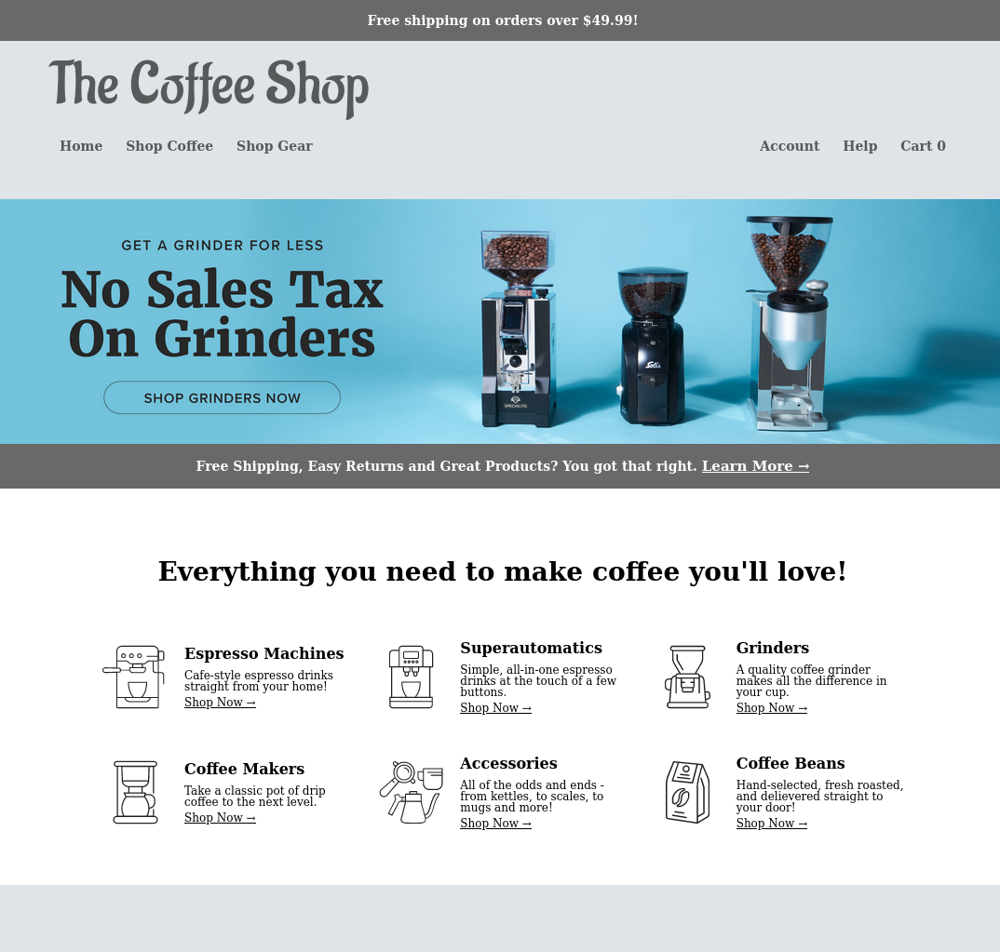

# Shopping Cart App 

View the project live [here](https://brenton-j-andrews.github.io/shopping-cart/).

-----

#### About this project.

Completed for [The Odin Project](https://www.theodinproject.com/lessons/node-path-javascript-shopping-cart) JavaScript course.

This project is a simple multi-page shopping site mock up that uses React to save cart state. Users can add, update and remove items from their cart and 
even qualify for free shipping! 

The design, icons and images were sourced from [Seattle Coffee Gear](https://www.seattlecoffeegear.com/), so head there is any of this coffee looks tasty!

-----

##### Frameworks

This project was built using React and React-Router-Dom.

-----

##### Takeaways

This project put to practice what I have learned with React and React-Router-Dom and gave me some experience with React debugging.

-----

##### TODO

This kind of project can be extended significantly beyond its current state, but I am working on other things. Here are some things that could be added in the future though for a more realistic website.

- Add React interaction tests / unit testing.
- Add product filters for the shopping page and styling for the filter menu.
- Add pages for each individual product -> dynamic URL building!
